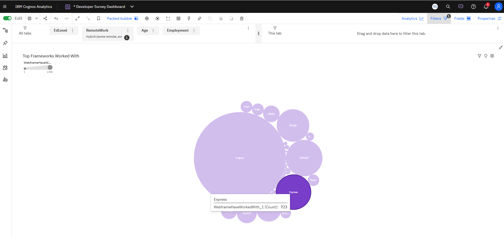

# cognos-developer-technology-dashboard
Interactive IBM Cognos Analytics dashboard exploring developer programming languages, databases, cloud platforms, and web frameworks using survey data visualization techniques.
# Developer Technology Usage Dashboard

An interactive IBM Cognos Analytics dashboard exploring developer technology trends using survey-based data visualization techniques.

This dashboard analyzes commonly used programming languages, databases, cloud platforms, and web frameworks among developers. The goal of the project was to transform complex multi-value survey data into meaningful visual insights that support exploration and comparison across technology categories.

---

# Project Goals

The dashboard was designed to:

- Explore trends in developer technology usage
- Compare the popularity of programming languages and databases
- Visualize platform and framework adoption patterns
- Demonstrate interactive dashboard design using IBM Cognos Analytics
- Practice transforming and visualizing complex survey datasets

---

# Dashboard Features

## Interactive Filters

Users can dynamically filter dashboard results by:

- Education level
- Remote work preference
- Age group
- Employment status

These filters allow the dashboard to support exploratory analysis and uncover how developer preferences vary across demographics and work environments.

---

# Top Programming Languages Used by Developers

This horizontal bar chart highlights the most commonly used programming languages among survey respondents.

The visualization makes it easy to compare adoption levels across languages and quickly identify dominant technologies such as:

- C
- C++
- HTML/CSS
- JavaScript
- Haskell

The horizontal layout improves readability for larger category labels and allows clear comparison between technologies.

---

# Most Popular Databases Among Developers

This bar chart compares database technologies used by developers across the dataset.

The chart surfaces strong adoption of databases such as:

- MongoDB
- PostgreSQL
- Elasticsearch
- MariaDB
- MySQL

The visualization helps identify both mainstream and niche database technologies within the developer ecosystem.

---

# Platforms Worked With

The word cloud visualization provides a high-level overview of cloud and hosting platforms commonly used by developers.

Larger words represent higher usage frequency, making it easy to spot dominant platforms such as:

- Amazon Web Services (AWS)
- Microsoft Azure
- Google Cloud

This visualization provides an accessible summary of platform adoption trends while adding visual variety to the dashboard experience.

---

# Most Popular Web Frameworks Among Developers

The packed bubble chart visualizes relative popularity among web frameworks and development technologies.

Frameworks with larger bubbles indicate higher adoption rates within the dataset.

The visualization highlights technologies such as:

- Angular
- ASP.NET
- Django
- Express
- React

The packed bubble approach allows users to quickly compare proportional usage patterns in a more engaging visual format.

---

# Interactive Framework Exploration

The dashboard supports interactive exploration through filtering and hover interactions.

Users can:
- Filter dashboard results dynamically
- Hover over visual elements to view detailed counts
- Compare framework popularity across filtered segments

This interaction layer improves usability and transforms the dashboard from static reporting into an exploratory analytics experience.

---

# Data Preparation

The original survey dataset contained multiple semicolon-separated technology values within single columns.

To support accurate visualization and aggregation:
- Multi-value fields were split into separate columns
- Data was cleaned and structured inside IBM Cognos Analytics
- Visualizations were configured to aggregate technology usage counts dynamically

---

# Tools & Technologies

- IBM Cognos Analytics
- Data Visualization
- Dashboard Design
- Data Preparation & Transformation
- Interactive Filtering
- Survey Data Analysis

---

# Key Takeaways

This project demonstrates:
- Dashboard storytelling
- Interactive business intelligence design
- Visualization selection based on data type
- Cleaning and transforming complex survey datasets
- Comparative analysis through interactive exploration

The final dashboard combines analytical clarity with interactive exploration to create a more engaging user experience for technology trend analysis.
